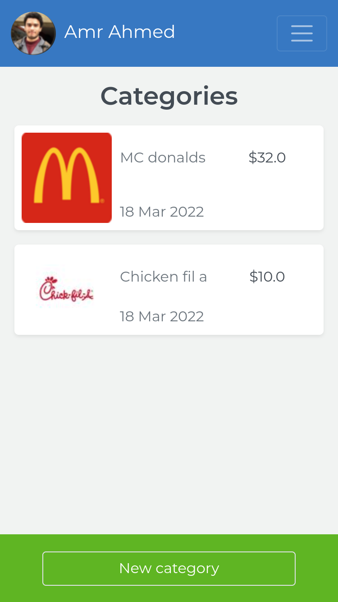
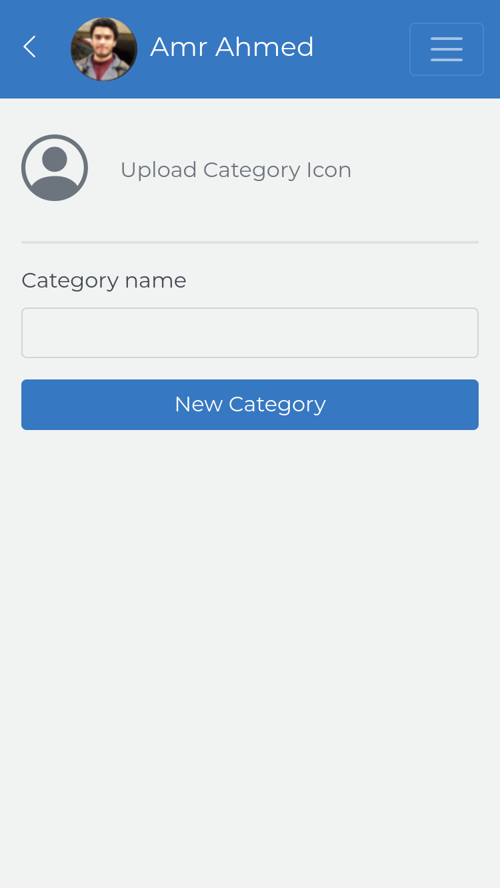
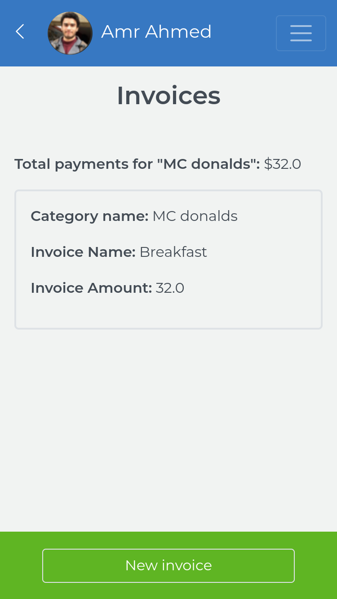
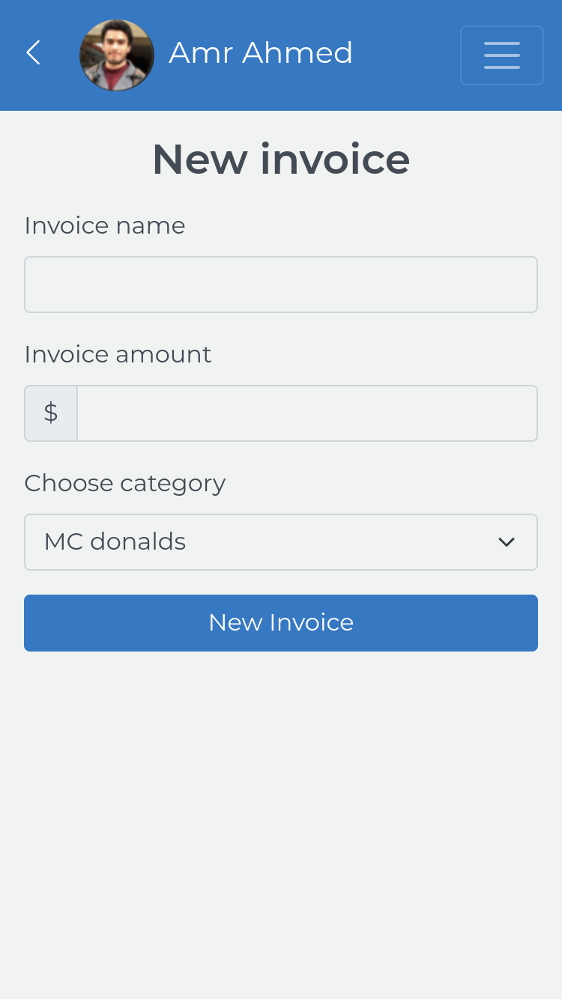

# Budgetly

> manage your budget

|               Categories page                |               New category page                |
| :------------------------------------------: | :--------------------------------------------: |
|  |  |

|               Category Invoices page                |               New Invoice page                |
| :-------------------------------------------------: | :-------------------------------------------: |
|  |  |

> a mobile web application where you can manage your budget: you have a list of transactions associated with a category, so that you can see how much money you spent and on what.

## Built With

- Ruby on Rails
- Bootstrap 5, Bootstrap_ruby_forms
- PostgreSQL
- Devise
- ActiveStorage

## Live demo

[Project live demo](https://yourbudgetly.herokuapp.com/)
<br>
<br>
[Project walk through](https://www.loom.com/share/d60eefc20a894fa2ac8226535ef9fdf1)

## Getting Started

To get a local copy up and running follow these simple example steps.

Simply click on `Code` drop down menu should appear then `download ZIP` after extraction you could follow `Usage` step

### Prerequisites

`gems`
`ruby`
`postgres`

### Setup

###### Do this step if you didn't download as ZIP, if you did, skip to next step please

to setup the project on your local, run these commands

```shell
git clone https://github.com/Amrhub/Budgetly.git

cd Budgetly  // to open the project
```

### Install

```shell
    bundler # install dependencies
```

### Usage

To make sure project works as expected create instance file from `config/application_example.yml` with name "application.yml" with required data in application_example.

```shell
    rails db:create # create database
    rails db:migrate # migrate tables
    # or use rails db:schema:load instead of previous commands but it will depend on latest version of schema.rb when running

    bin/dev # start local host
    rails c # to start rails console
```

### Tests

```shell
rspec # Run all tests
rspec spec/models # run tests for only models
```

## Author

👤 **Amr Ahmed**

- GitHub: [@Amrhub](https://github.com/Amrhub)
- LinkedIn: [Amr Ahmed](https://linkedin.com/in/amr-abdelrehim-ahmed)

## 🤝 Contributing

Contributions, issues, and feature requests are welcome!

Feel free to check the [issues page](../../issues/).

## ⭐️ Acknowledgements

Original design idea by [Gregoire Vella on Behance](https://www.behance.net/gregoirevella).

## Show your support

Give a ⭐️ if you like this project!

## 📝 License

This project is [MIT](./MIT.md) licensed.
